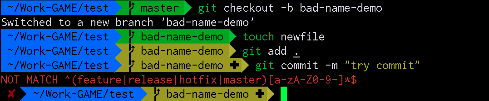
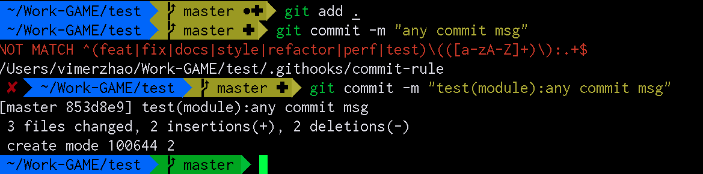
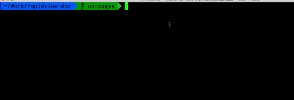

= Git工程化最佳实践
:toc: left
:icons: font
:sectnums:
:appendix-caption: 附录
:sectnumlevels: 2

== 前言
大部分程序员对于Git的理解还停留在

----
git add .
git commit -m "update"
git push
----

的阶段，但这在实际项目开发中是远远不够的。 +
举一个简单的例子，现在我们需要过滤所有修复bug的提交，该怎么做？显然是无法做到的，因为无法从commit信息获知。但是，如果我们在每次commit信息里面都注明提交的类型，是不是就可以通过过滤指定类型来达到目的了。
再举一个例子，如果我们的分支命名都是

----
master-01
master-02
feature-add_sd_card_permission
bugfix-id-342141
bugfix-authorize-error
----
这种格式，我们是不是很不方便去做定位分支的负责人，过滤指定分支等操作，更不用说视觉上的混乱所造成的困扰了。 +
基于以上两个例子，Git使用的工程化、标准化是十分必要的。 +
本文基于作者工作中教训和思考积淀而成，虽曰“最佳”，但也只是现阶段我心中的最佳实践，仅供参考。

== 配置
本项目提供了一个基于Git最佳实践的配套工具，是对后文各种规范的一种强制保证，因为规范不一定会被遵守，所以需要辅助工具来确保规范的执行。主要包括

- [x] 基于 `hook` 能力的 *客户端* 检查，如分支命名检查、commit信息格式检查
- [ ] 基于 `hook` 能力的 *服务器端* 检查，
- [x] 基于日常开发需要，封装常见操作，降低使用成本，如查看分支最后更新时间以提醒清理、统计一段时间内开发者的代码提交数量

如何配置？首先 `cd path/to/your/project` ，然后复制以下代码并执行

[source,shell]
----
git clone https://github.com/vimerzhao/git-standardize.git ~/.git-standardize
git config core.hooksPath ~/.git-standardize/.githooks
cd ~/git-standardize/.githooks
chmod +x *[^rule]
cd -
echo "source ~/.git-standardize/git-command.sh" >> .bashrc
echo "source ~/.git-standardize/git-command.sh" >> .zshrc
----

== branch规范
只允许使用以下分支命名项目

* `master`
** 主分支，也是用于部署生产环境的分支，确保 `master` 分支稳定性，任何时间都不能直接修改代码
* `release`
** `release` 为预上线分支，发布提测阶段，会 `release` 分支代码为基准提测
** 分支命名细则: `release-version`
** 当有一组 `feature` 开发完成，首先会合并到 `master` 分支，进入提测时，会创建 `release` 分支
** 如果测试过程中若存在bug需要修复，则直接由开发者在 `release` 分支修复并提交
** 当测试完成，经过一个周期的灰度之后，合并 `release` 分支到 `master` 分支
** `release` 分支的最终状态是每个线上版本的归档镜像
* `hotfix`
** 线上出现紧急问题时，需要及时修复，以 `master` 分支为基线，创建 `hotfix` 分支，修复完成后，需要合并到 `master` 分支和处于待发布的 `release` 分支
** 分支命名细则: `hotfix-creator-description`
* `feature`
** 开发新功能时，以 `master` 为基础创建 `feature` 分支
** 分支命名细则: `feature-creator-description`

WARNING: 是否需要引入 `develop` 分支以维持 `master` 分支的稳定性（上述机制的不足之处）有待商榷，过于复杂也不是一件好事，保证 *合入分支自身的质量* 看起来是更好的解决方案

如果创建了不规范分支， `git-standardize` 会报错

== commit规范

参考 https://github.com/angular/angular.js/blob/master/DEVELOPERS.md#-git-commit-guidelines[angular.js commit规范] +
针对客户端的每次提交限制格式如下

[source,bash]
----
<type>(<scope>):<subject> # <1> <2> <3>
<BLANK LINE>
<body> <4>
<BLANK LINE>
<footer> <5>
----
<1> `type`:本次改动的类型
** feat: 添加新特性
** fix: 修复bug
** docs: 仅仅修改了文档
** style: 仅仅修改了空格、格式缩进、都好等等，不改变代码逻辑
** refactor: 代码重构，没有加新功能或者修复bug
** perf: 增加代码进行性能测试
** test: 增加测试用例
** chore: 改变构建流程、或者增加依赖库、工具等
<2> `scope`:本次改动影响的范围，建议每个工程划分好自己的模块，方便填写
<3> `subject`:本次改动的简要描述，一般写这个就够了
<4> `body`:更详细的改动说明，一般不使用，因为不推荐这么大的改动
<5> `footer`:描述下与之关联的 issue 或 break change，一般不使用

[NOTE]
====
.建议
* 建议每次Commit的粒度不要太大，方便CodeReview
* `fix` 类型的提交最好附带上bug链接之类的信息
====

效果

== 命令
所有的辅助命令均以 `gs_` 开头，这样的好处是可以利用 `Tab` 键的补全机制自动选择命令，避免冗长难记的输入

=== gs_clear_local_barnch
清理本地存在但是服务器端不存在的分支 +

=== gs_branch_last_commit
查看分支最后提交人和存活周期，辅助删除过期分支 +

=== gs_past_commit_statistic
统计过去一段时间内的代码提交数量，参数 +

* $1 : 时间段或者起始时间，如 `7.days` 、`2019-10-10`

== 参考
* https://jaeger.itscoder.com/dev/2018/09/12/using-git-in-project.html[项目中的 Git 使用规范]
* https://nvie.com/posts/a-successful-git-branching-model/[A successful Git branching model]
* https://github.com/geeeeeeeeek/git-recipes/wiki/5.4-Git-%E9%92%A9%E5%AD%90%EF%BC%9A%E8%87%AA%E5%AE%9A%E4%B9%89%E4%BD%A0%E7%9A%84%E5%B7%A5%E4%BD%9C%E6%B5%81[5.4 Git 钩子：自定义你的工作流]
* 

