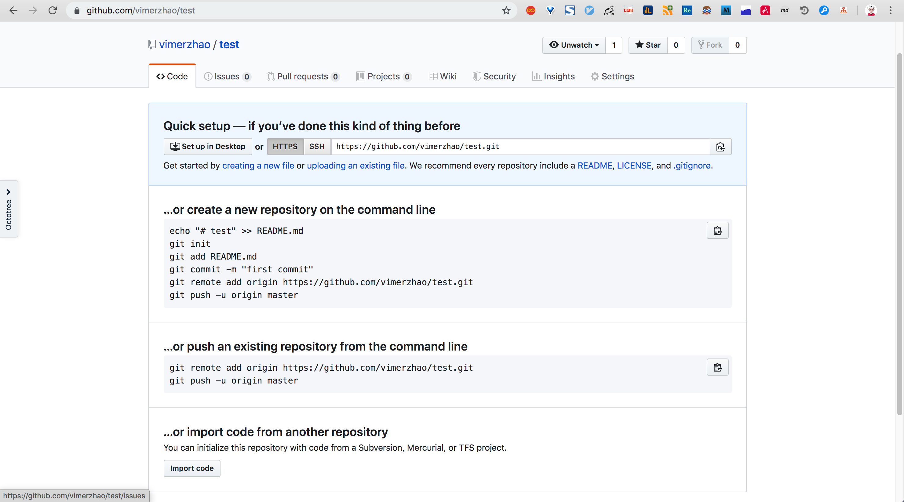

= Git工程化最佳实践
:toc: left
:icons: font
:sectnums:
:appendix-caption: 附录
:sectnumlevels: 3

== 本文宗旨
大部分程序员对于Git的理解还停留在

----
git add .
git commit -m "update"
git pull
git push
----

的阶段，但这在实际项目开发中是远远不够的。 +
举一个简单的例子，现在我们需要过滤所有修复bug的提交，该怎么做？显然是无法做到的，因为无法从commit信息获知。但是，如果我们在每次commit信息里面都注明提交的类型，是不是就可以通过过滤指定类型来达到目的了。 +
再举一个例子，如果我们的分支命名都是

----
master-01
master-02
feature-add_sd_card_permission
bugfix-id-342141
bugfix-authorize-error
----

这种格式，我们是不是很不方便去做 *定位分支的负责人，过滤指定分支* 等操作，更不用说视觉上的混乱所造成的困扰了。 +
再比如，笔者近来发现某个仓库有大量构建产生的中间文件，究其原因，发现是因为管理人员设置的 `.gitignore` 配置如下

----
....
/build
....
----

显然，这种写法无法忽略子模块的 build 目录。

基于以上三个例子，Git使用的工程化、标准化是十分必要的。 +
我们所谓的造轮子，亦不仅仅存在于编程中，日常工作中常有大量的重复工作，亦是一种论文，本文即希望规范化、流程化Git的使用，以期提高开发者的效率。
本文基于作者工作中教训和思考积淀而成，虽曰“最佳”，但也只是现阶段我心中的最佳实践，仅供参考。

== 仓库创建
无论是Github还是工蜂，我们新建一个Git仓库后，往往会出现以下提示：

某种意义上，这幅图会带来很多误解，我们在创建一个Git仓库后还有很多事情要做，一开始，我们或许习惯于渐进式的改进，但我们应该意识到这种工作是可以 *流程化、自动化* 的，即不要等到发现问题再去解决，而应该一开始就建立有效、可复用的机制。

=== 信息配置
使用 `git config` 配置必须要的用户信息+

反面案例：

----
腾讯内部每个员工有自己的英文名和tencent邮箱，但是部分开发人员未注意，导致诸如
name(中文名)
name@gmail.com
的信息进入了提交历史
----

* [ ] GitHook支持

=== gitignore

link:https://github.com/github/gitignore[github-gitignore] 提供了各类型项目的 `.gitignore` 模版，基本可以直接使用，如需定制，参考 link:https://git-scm.com/docs/gitignore[Git - gitignore Documentation] ，确保自己理解了语法规则。

=== 分支规范

只允许使用以下分支命名项目

* `master`
** 主分支，也是用于部署生产环境的分支，确保 `master` 分支稳定性，任何时间都不能直接修改代码
* `release`
** `release` 为预上线分支，发布提测阶段，会 `release` 分支代码为基准提测
** 分支命名细则: `release-version`
** 当有一组 `feature` 开发完成，首先会合并到 `master` 分支，进入提测时，会创建 `release` 分支
** 如果测试过程中若存在bug需要修复，则直接由开发者在 `release` 分支修复并提交
** 当测试完成，经过一个周期的灰度之后，合并 `release` 分支到 `master` 分支
** `release` 分支的最终状态是每个线上版本的归档镜像
* `hotfix`
** 线上出现紧急问题时，需要及时修复，以 `master` 分支为基线，创建 `hotfix` 分支，修复完成后，需要合并到 `master` 分支和处于待发布的 `release` 分支
** 分支命名细则: `hotfix-creator-description`
* `feature`
** 开发新功能时，以 `master` 为基础创建 `feature` 分支
** 分支命名细则: `feature-creator-description`

WARNING: 是否需要引入 `develop` 分支以维持 `master` 分支的稳定性（上述机制的不足之处）有待商榷，过于复杂也不是一件好事，保证 *合入分支自身的质量* 看起来是更好的解决方案

=== commit规范

参考 https://github.com/angular/angular.js/blob/master/DEVELOPERS.md#-git-commit-guidelines[angular.js commit规范] +
针对客户端的每次提交限制格式如下

[source,bash]
----
<type>(<scope>):<subject> # <1> <2> <3>
<BLANK LINE>
<body> <4>
<BLANK LINE>
<footer> <5>
----
<1> `type`:本次改动的类型
** feat: 添加新特性
** fix: 修复bug
** docs: 仅仅修改了文档
** style: 仅仅修改了空格、格式缩进、都好等等，不改变代码逻辑
** refactor: 代码重构，没有加新功能或者修复bug
** perf: 增加代码进行性能测试
** test: 增加测试用例
** chore: 改变构建流程、或者增加依赖库、工具等
<2> `scope`:本次改动影响的范围，建议每个工程划分好自己的模块，方便填写
<3> `subject`:本次改动的简要描述，一般写这个就够了
<4> `body`:更详细的改动说明，一般不使用，因为不推荐这么大的改动
<5> `footer`:描述下与之关联的 issue 或 break change，一般不使用

[NOTE]
====
.建议
* 建议每次commit的粒度不要太大，方便CodeReview
* `fix` 类型的提交最好附带上bug链接之类的信息
====

=== GitHook

GitHook应该在仓库创建之后尽早设置，为了避免重复工作，笔者以及针对上文提到的信息配置、分支规范和commit规范等提供了 *强制检查* 的能力，引入方式如下

[source,shell]
----
cd ..
git clone http://git.code.oa.com/vimerzhao/git-standardize.git
cd -
cp -R ../git-standardize/.githooks ./
cd .githooks
chmod +x *[^rule]
cd ..
git config core.hooksPath .githooks
cd ..
rm -rf git-standardize
cd -
----

如果管理员配置好了hook并完成了服务器端的push，那么对于其他开发者，只需要

[source,shell]
----
git pull --rebase
git config core.hooksPath .githooks
----

使用效果如下：

.非法分支命名
image:./assets/Snipaste_2019-10-24_15-17-33.png[alt="Demo"]

.非法commit信息
image:./assets/Snipaste_2019-10-24_15-13-58.png[alt="Demo"]

== 仓库使用

=== GitHook
如上所述，使用者clone下仓库后应该配置本地GitHook，避免不小心提交脏信息

[source,shell]
----
git clone ****
git config core.hooksPath .githooks
----

=== 别名设置
==== Bash别名

==== oh-my-zsh

link:https://github.com/robbyrussell/oh-my-zsh/wiki/Cheatsheet#git[git-cheatsheet]

==== Git别名

=== 命令封装

所有的辅助命令均以 `gs_` 开头，这样的好处是可以利用 `Tab` 键的补全机制自动选择命令，避免冗长难记的输入

image:./assets/ezgif-1-2df9ac477e34.gif[alt="Demo"]

==== gs_clear_local_barnch
清理本地存在但是服务器端不存在的分支 +

==== gs_branch_last_commit
查看分支最后提交人和存活周期，辅助删除过期分支 +

==== gs_past_commit_statistic
统计过去一段时间内的代码提交数量，参数 +

* $1 : 时间段或者起始时间，如 `7.days` 、`2019-10-10`

== 持续优化

=== 使用命令行

=== 维护dotfile

